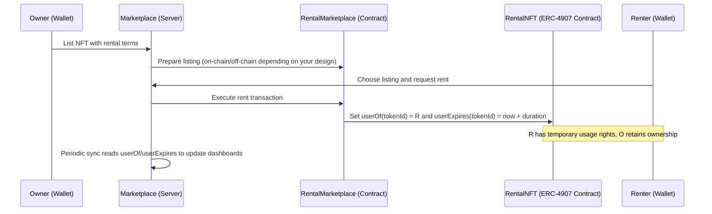

# RentalNFT— NFT Rental Marketplace (Blockchain Overview)

RentalNFT is an NFT rental marketplace built around ERC‑4907’s rentable NFT standard. It combines on-chain ownership and user rights (via ERC‑4907) with an off-chain app experience for discovery, listing, and portfolio insights. This README focuses on the blockchain side of the project and what the app is doing at a protocol and data level.

## What This Project Does

- Provides a marketplace where NFT owners can list assets for sale or short-term rental.
- Uses ERC‑4907 to assign a temporary “user” to an NFT without transferring ownership.
- Verifies on-chain ownership and contract capabilities before allowing actions.
- Stores enriched metadata off-chain (IPFS and JSON datastore) to power a rich UI and fast discovery.
- Periodically syncs rental state from chain to off-chain views so the dashboard stays accurate.

## Smart Contracts

- ERC‑4907 (Rentable NFT standard)
  - Files: `contracts/ERC4907.sol`, `contracts/IERC4907.sol`
  - Adds `userOf(tokenId)` and `userExpires(tokenId)` to NFTs to support time-bound usage without transferring ownership.

- RentalNFT (Project-specific)
  - File: `contracts/RentalNFT.sol`
  - Typically extends ERC‑4907 to mint NFTs that support rentable semantics out of the box.

- RentalMarketplace (Project-specific)
  - File: `contracts/RentalMarketplace.sol`
  - Coordinates listing, renting, and duration-based payments/escrow logic (depending on your implementation).
  - Keeps the flow trust-minimized by relying on ERC‑4907 user assignments for rentals.

Note: This repo ships contracts and a Hardhat setup. Update addresses after deployment and wire them into the server via environment variables as described below.

## Networks and Configuration

- Primary test network: Sepolia
- Config file: [config/blockchain.js](cci:7://file:///c:/Users/under/Desktop/aniiiiiii/RentalNFT/config/blockchain.js:0:0-0:0)
  - `sepolia.rpcUrl` — RPC endpoint for the Sepolia network
  - `contracts.rentalNFT` — Deployed RentalNFT address
  - `contracts.rentalMarketplace` — Deployed marketplace address
  - `platform.feeBps` and `platform.feeRecipient` — Marketplace fee configuration
  - `gas.gasLimit` and `gas.gasPrice` — Default gas settings

Environment variables (server)
- `SEPOLIA_RPC_URL` — HTTPS RPC provider (Infura, Alchemy, etc.)
- `RENTAL_NFT_CONTRACT_ADDRESS` — Deployed RentalNFT address
- `RENTAL_MARKETPLACE_CONTRACT_ADDRESS` — Deployed RentalMarketplace address
- `PLATFORM_FEE_BPS` — Platform fee in basis points (e.g., 500 for 5%)
- `FEE_RECIPIENT_ADDRESS` — Address receiving platform fees

## On-Chain Interactions

- Ownership verification
  - [services/nftVerification.js](cci:7://file:///c:/Users/under/Desktop/aniiiiiii/RentalNFT/services/nftVerification.js:0:0-0:0) performs reads against the NFT contract:
    - `ownerOf(tokenId)` to validate current owner
    - Contract interface probing to detect ERC‑4907 or ERC‑721 traits
  - Off-chain checks ensure the wallet attempting actions matches on-chain ownership.

- Rental state checks (ERC‑4907)
  - [controllers/rentalController.js](cci:7://file:///c:/Users/under/Desktop/aniiiiiii/RentalNFT/controllers/rentalController.js:0:0-0:0) uses `ethers` to query:
    - `userOf(tokenId)`
    - `userExpires(tokenId)`
  - These are used to compute whether a token is actively rented and until when.

- Periodic rental sync
  - The server periodically calls [syncRentalFor(contractAddress, tokenId)](cci:1://file:///c:/Users/under/Desktop/aniiiiiii/RentalNFT/controllers/rentalController.js:21:0-99:1):
    - Reads on-chain `owner`, `user`, and `userExpires`.
    - Updates the off-chain datastore with current rental status.
    - Reconciles owner/renter dashboards (owned vs. rented-out vs. rented).

- Wallet-based access
  - The UI uses wallet connection for login.
  - Off-chain user records are keyed by `walletAddress` and receive a JWT for subsequent API usage.
  - This avoids email/password flows while still mapping on-chain identity to off-chain UX.

## Off-Chain Data and IPFS

- IPFS integration
  - File: [services/ipfs.js](cci:7://file:///c:/Users/under/Desktop/aniiiiiii/RentalNFT/services/ipfs.js:0:0-0:0)
  - Used to pin NFT metadata/assets or user-generated content related to listings.
- JSON datastore
  - File: [services/datastore.js](cci:7://file:///c:/Users/under/Desktop/aniiiiiii/RentalNFT/services/datastore.js:0:0-0:0)
  - A lightweight local datastore that replaces a database for rapid development.
  - Repositories read/write domain objects:
    - [repositories/nftRepo.js](cci:7://file:///c:/Users/under/Desktop/aniiiiiii/RentalNFT/repositories/nftRepo.js:0:0-0:0)
    - [repositories/listingRepo.js](cci:7://file:///c:/Users/under/Desktop/aniiiiiii/RentalNFT/repositories/listingRepo.js:0:0-0:0)
    - [repositories/userRepo.js](cci:7://file:///c:/Users/under/Desktop/aniiiiiii/RentalNFT/repositories/userRepo.js:0:0-0:0)
    - [repositories/nftContractRepo.js](cci:7://file:///c:/Users/under/Desktop/aniiiiiii/RentalNFT/repositories/nftContractRepo.js:0:0-0:0)

This hybrid approach keeps on-chain trust (ownership/rental) while enabling fast search, filters, and aggregated analytics off-chain.

## Architecture Overview

- Contracts define truth for:
  - Who owns the NFT.
  - Who currently has user rights (rentals) and when they expire.
- Server (Node/Express) handles:
  - Reading blockchain state via `ethers` and the configured RPC.
  - Mapping wallet addresses to app users and enriching NFTs with metadata.
  - Periodically syncing rental state for an accurate dashboard view.
- Frontend (EJS + Tailwind) handles:
  - Wallet connect and JWT handling.
  - Display of owned NFTs, listings, and rental status (driven by off-chain reads that mirror the chain).

## Typical Rental Flow (High-Level)



## Project Structure (Blockchain-Relevant)

- `contracts/`
  - [ERC4907.sol](cci:7://file:///c:/Users/under/Desktop/aniiiiiii/RentalNFT/c:/Users/under/Desktop/aniiiiiii/RentalNFT/contracts/ERC4907.sol:0:0-0:0)
  - [IERC4907.sol](cci:7://file:///c:/Users/under/Desktop/aniiiiiii/RentalNFT/c:/Users/under/Desktop/aniiiiiii/RentalNFT/contracts/IERC4907.sol:0:0-0:0)
  - [RentalNFT.sol](cci:7://file:///c:/Users/under/Desktop/aniiiiiii/RentalNFT/c:/Users/under/Desktop/aniiiiiii/RentalNFT/contracts/RentalNFT.sol:0:0-0:0)
  - [RentalMarketplace.sol](cci:7://file:///c:/Users/under/Desktop/aniiiiiii/RentalNFT/c:/Users/under/Desktop/aniiiiiii/RentalNFT/contracts/RentalMarketplace.sol:0:0-0:0)
- [hardhat.config.js](cci:7://file:///c:/Users/under/Desktop/aniiiiiii/RentalNFT/c:/Users/under/Desktop/aniiiiiii/RentalNFT/hardhat.config.js:0:0-0:0)
  - Hardhat toolbox setup and compiler versioning
- [services/](cci:7://file:///c:/Users/under/Desktop/aniiiiiii/RentalNFT/services:0:0-0:0)
  - [nftVerification.js](cci:7://file:///c:/Users/under/Desktop/aniiiiiii/RentalNFT/services/nftVerification.js:0:0-0:0) (reads blockchain to verify ownership/metadata)
  - [ipfs.js](cci:7://file:///c:/Users/under/Desktop/aniiiiiii/RentalNFT/services/ipfs.js:0:0-0:0) (IPFS pinning utilities)
  - [datastore.js](cci:7://file:///c:/Users/under/Desktop/aniiiiiii/RentalNFT/services/datastore.js:0:0-0:0) (JSON datastore for rapid development)
- `config/`
  - [blockchain.js](cci:7://file:///c:/Users/under/Desktop/aniiiiiii/RentalNFT/config/blockchain.js:0:0-0:0) (network, contracts, gas, platform fees)

## Development and Deployment (Contracts)

Prerequisites
- Node.js LTS
- A funded testnet wallet (Sepolia ETH) for deployments
- RPC endpoint (Infura/Alchemy) for Sepolia

Install dependencies
```bash
npm install
```

Compile contracts
```bash
npx hardhat compile
```

Deploy contracts (example)
- Create a `.env` in the project root with:
  - `SEPOLIA_RPC_URL=...`
  - `PRIVATE_KEY=0x...` (deployer key; never commit this)
- Add/Use a deployment script (e.g., `scripts/deploy.js`) to deploy and print addresses.
- Run:
```bash
npx hardhat run scripts/deploy.js --network sepolia
```

Wire deployed addresses into the server
- Set `RENTAL_NFT_CONTRACT_ADDRESS` and `RENTAL_MARKETPLACE_CONTRACT_ADDRESS` in `.env`.
- Optionally tweak platform fee settings:
  - `PLATFORM_FEE_BPS`, `FEE_RECIPIENT_ADDRESS`

Start the app
```bash
npm run dev
```

## Security Considerations

- Signature verification
  - For production, consider signature-based login (e.g., SIWE) to cryptographically prove wallet ownership on login.
- Contract audits
  - Ensure `RentalNFT` and `RentalMarketplace` are audited and tested for reentrancy, access control, and economic exploits.
- Rate limiting and CORS
  - Already enabled in [server.js](cci:7://file:///c:/Users/under/Desktop/aniiiiiii/RentalNFT/server.js:0:0-0:0) (rate limiting and CORS) to protect the API layer.
- Secrets management
  - Store RPC URLs, private keys, and JWT secrets in environment variables or a secure secret manager.

## Known Limitations / Future Work

- Add robust signature-based auth (nonce + wallet signature) to harden wallet login.
- Expand marketplace auctions/escrow logic depending on your business rules.
- Enhance IPFS pinning with redundancy and pinning services.
- Replace JSON datastore with a production-grade DB and indexing layer (e.g., Postgres + TheGraph).
- Add unit/integration tests for smart contracts (Hardhat + Chai).

---

If you want, I can also add a Hardhat deployment script and an example `.env.example` specifically for contract deployment to streamline end-to-end setup.
